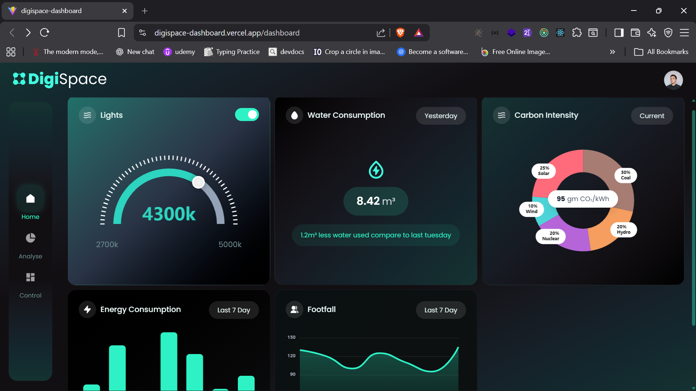
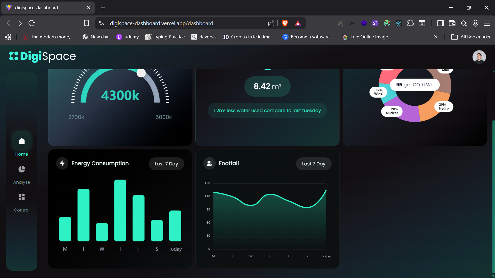
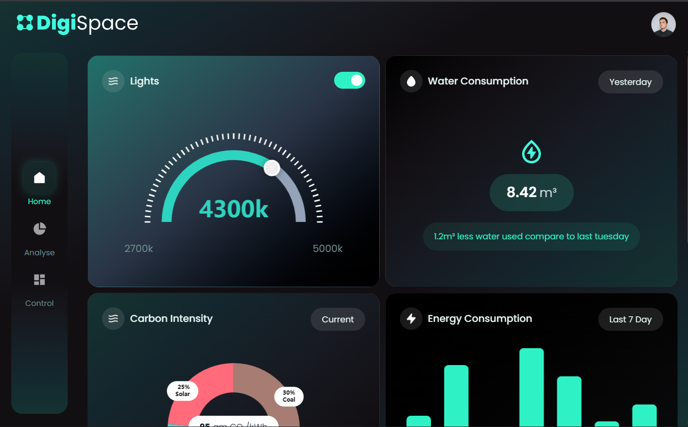
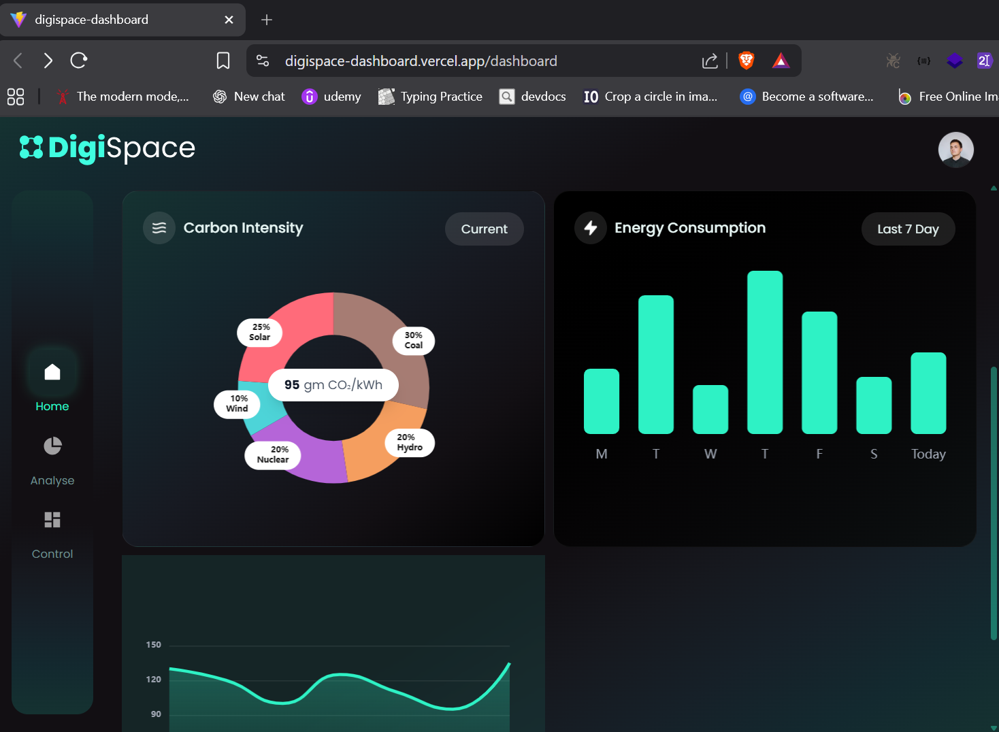
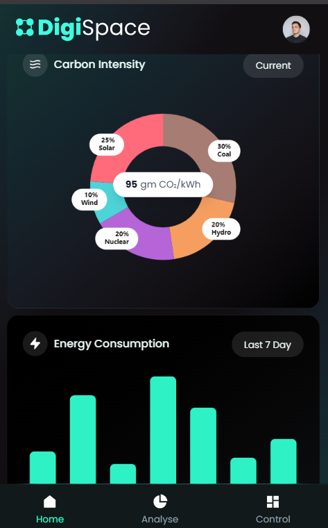

# Digispace Dashboard

A pixel-perfect React dashboard implementation based on the provided UI design.

This project was built as part of a Frontend Developer technical assessment.  
The implementation focuses on UI accuracy, reusable architecture, responsiveness, and clean state management.

---

## 🌐 Live Demo

🔗 **Production Link:**  
https://digispace-dashboard.vercel.app/

---

## 🖼️ Screenshots

### Desktop View





### Tablet View




### Mobile View



---

## 🛠 Tech Stack

- React (Vite)
- TypeScript
- Tailwind CSS
- Redux Toolkit
- Redux Persist
- React Router v6
- Apache ECharts

---

## 📐 Design Implementation

- Pixel-perfect layout implementation
- Followed provided fonts and color codes carefully
- Used provided UI assets and icons
- Modular card-based component structure
- Achieved high visual parity with the reference design

---

## 📊 Dashboard Components

All cards are implemented as independent reusable components:

- Lights Card (Gauge Chart)
- Water Consumption Card
- Carbon Intensity Card (Donut Chart)
- Energy Consumption Card (Bar Chart)
- Footfall Card (Line Chart)

Charts are implemented using Apache ECharts.

---

## 📱 Responsive Implementation

Although the original design was not responsive, the following improvements were added:

- Fully responsive grid layout
- Sidebar converts to bottom navigation on mobile
- Adaptive layout based on number of cards
- Proper spacing adjustments for tablet and desktop
- Custom scrollbar styling
- Scrollable main content with fixed header and sidebar

### Primary Design Resolution

- 1920x1080 (Desktop)

### Additional Breakpoints Implemented

- 1440px
- 1024px
- 768px
- Mobile screens

---

## 🔐 Authentication (Additional Feature)

To enhance usability and demonstrate application-level architecture, authentication was implemented:

- Google Login (Firebase)
- Guest Login (Redux-based simulation)
- Logout functionality
- Protected routes
- Conditional navigation based on login state
- User profile popover with username and logout option
- Avatar fallback support

---

## 🧱 Architecture Highlights

- Clean and scalable folder structure
- Feature-based organization
- Reusable chart components
- Layout separation (PostLoginLayout)
- Protected routing system
- Centralized state management using Redux Toolkit
- Persistent login using Redux Persist

---

## ⚙️ Setup Instructions

### 1. Clone the repository

```bash
git clone https://github.com/vedhatech002/digispace-dashboard

2. Install dependencies
npm install

3. Run development server
npm run dev

4. Build for production
npm run build


```

👨‍💻 Author

Vijayavedhasekaran K
Frontend Developer | React | TypeScript

LinkedIn: https://www.linkedin.com/in/vijayavedhasekaran/
